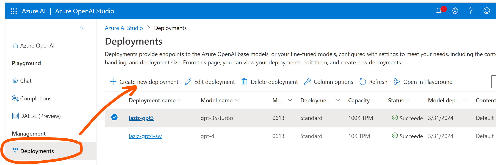
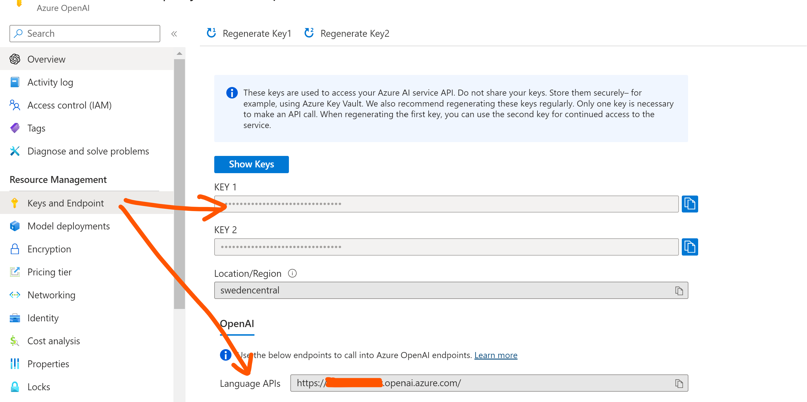
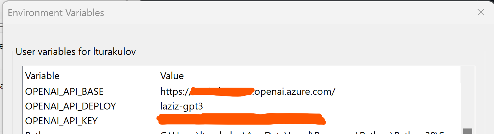

# Calculating token usage in OpenAI and Azure OpenAI endpoints API calls with and without Streaming
By default, when you call an OpenAI or Azure OpenAI API endpoint, it's necessary to wait for the the entire completion to get generated before it's returned to the calling application. The longer is the completion, the longer it takes to get the response.

If you want to change this user experience and get completion in chunks as it's being generated, then you can set Chat Completion's API paramemer stream to True (by default it's set to False). This would allow your Generative AI solution to start processing those chunks in almost real-time and not to wait till the full completion.
```
stream=True
```

## Table of contents:
- [1. Prerequisites](https://github.com/LazaUK/AOAI-Streaming-TokenUsage#1-prerequisites)
- [2. Shared helper functions](https://github.com/LazaUK/AOAI-Streaming-TokenUsage#2-shared-helper-functions)
- [3. System- and Tiktoken-calculated token usage in non-streaming API calls](https://github.com/LazaUK/AOAI-Streaming-TokenUsage#3-system--and-tiktoken-calculated-token-usage-in-non-streaming-api-calls)
- [4. Tiktoken-calculated token usage in streaming API calls](https://github.com/LazaUK/AOAI-Streaming-TokenUsage#4-tiktoken-calculated-token-usage-in-streaming-api-calls)

## 1. Prerequisites
These notebooks would require installation of 2 Python packages:
1. Interactions with API endpoint are enabled through openai package. You can install it with the following pip command.
```
pip install --upgrade openai
```
2. Conversion of texts into tokens and calcualtion of their numbers can be achieved through tiktoken package. You can install it with the following pip command.
```
pip install --upgrade tiktoken
```
3. Next, deploy relevant GPT model in your Azure OpenAI resource and copy its name.

4. Then copy API endpoint and key details.

5. Finally, create environment variables OPENAI_API_DEPLOY, OPENAI_API_BASE and OPENAI_API_KEY, and assign to them copied deployment name, API endpoint and key details from the previous steps.


## 2. Shared helper functions
Both Jupyter noteboooks the same two helper functions:
1. Completions helper function "get_completion" is used to call ChatCompletion API and containts **stream** to switch Streaming on or off.
``` Python
def get_completion(prompt, model="gpt-3.5-turbo", engine=aoai_deployment):
    messages = [{"role": "user", "content": prompt}]
    response = openai.ChatCompletion.create(
        # model=model, # used by original OpenAI endpoint
        engine=engine, # used by Azure OpenAI endpoint
        messages=messages,
        temperature=0, # this is the degree of randomness of the model's output
        # stream=False, # default is False, set to True for streaming
    )
    return response
```
Tiktoken-enabled function "num_tokens_from_messages" is based on the sample code from [OpenAI's GitHub repo](https://github.com/openai/openai-cookbook/blob/main/examples/How_to_count_tokens_with_tiktoken.ipynb). Depending on the model type, it defines relevant Tiktoken parameters and utilises encoding operation to transform provided texts into tokens and return their count.

> **model** parameter's default value is set to v0613 of GPT-35-Turbo. 
``` Python
def num_tokens_from_messages(messages, model="gpt-3.5-turbo-0613"):
    """
    Return the number of tokens used by a list of messages.
    """
    
    try:
        encoding = tiktoken.encoding_for_model(model)
    except KeyError:
        print("Warning: model not found. Using cl100k_base encoding.")
        encoding = tiktoken.get_encoding("cl100k_base")

    if model in {
        "gpt-3.5-turbo-0613",
        "gpt-3.5-turbo-16k-0613",
        "gpt-4-0314",
        "gpt-4-32k-0314",
        "gpt-4-0613",
        "gpt-4-32k-0613",
        }:
        tokens_per_message = 3
        tokens_per_name = 1
    elif model == "gpt-3.5-turbo-0301":
        tokens_per_message = 4  # every message follows <|start|>{role/name}\n{content}<|end|>\n
        tokens_per_name = -1  # if there's a name, the role is omitted
    elif "gpt-3.5-turbo" in model:
        print("Warning: gpt-3.5-turbo may update over time. Returning num tokens assuming gpt-3.5-turbo-0613.")
        return num_tokens_from_messages(messages, model="gpt-3.5-turbo-0613")
    elif "gpt-4" in model:
        print("Warning: gpt-4 may update over time. Returning num tokens assuming gpt-4-0613.")
        return num_tokens_from_messages(messages, model="gpt-4-0613")
    else:
        raise NotImplementedError(
            f"""num_tokens_from_messages() is not implemented for model {model}. See https://github.com/openai/openai-python/blob/main/chatml.md for information on how messages are converted to tokens."""
        )
    
    num_tokens = 0

    if type(messages) == list:
        for message in messages:
            num_tokens += tokens_per_message
            for key, value in message.items():
                num_tokens += len(encoding.encode(value))
                if key == "name":
                    num_tokens += tokens_per_name
        num_tokens += 3  # every reply is primed with <|start|>assistant<|message|>
    elif type(messages) == str:
        num_tokens += len(encoding.encode(messages))
    return num_tokens
```

## 3. System- and Tiktoken-calculated token usage in non-streaming API calls
When the Streaming option is disabled, Completion payload contains "usage" dictionary with the count of prompt and completion tokens.
``` JSON
"usage": {
  "prompt_tokens": 12,
  "completion_tokens": 366,
  "total_tokens": 378
}
```
In "1_AOAI_NonStreaming_Count.ipynb" notebook, you can retrieve both the endpoint provided and Tiktoken-processed token count.
``` Python
print("System generated token usage:")
print(f"- Prompt tokens: {usage.prompt_tokens}")
print(f"- Completion tokens: {usage.completion_tokens}")
print(f"- Total tokens: {usage.total_tokens}\n")

tiktoken_prompt = [{"role": "user", "content": prompt}]
tiktoken_prompt_tokens = num_tokens_from_messages(tiktoken_prompt)
tiktoken_completion_tokens = num_tokens_from_messages(result)

print("Tiktoken-calculated token usage:")
print(f"- Prompt tokens: {tiktoken_prompt_tokens}")
print(f"- Completion tokens: {tiktoken_completion_tokens}")
print(f"- Total tokens: {tiktoken_prompt_tokens + tiktoken_completion_tokens}")
```
Both provide the same values, as expected:
``` JSON
System generated token usage:
- Prompt tokens: 12
- Completion tokens: 366
- Total tokens: 378

Tiktoken-calculated token usage:
- Prompt tokens: 12
- Completion tokens: 366
- Total tokens: 378
```

## 4. Tiktoken-calculated token usage in streaming API calls
When the Streaming option is enabled, Completion payload will no longer contain "usage" dictionary. That's why it would be necessary to calculate tokens using packages like tiktoken.
``` Python
tiktoken_prompt = [{"role": "user", "content": prompt}]
tiktoken_prompt_tokens = num_tokens_from_messages(tiktoken_prompt)
tiktoken_completion_tokens = num_tokens_from_messages("".join(result))

print("Tiktoken-calculated token usage:")
print(f"- Prompt tokens: {tiktoken_prompt_tokens}")
print(f"- Completion tokens: {tiktoken_completion_tokens}")
print(f"- Total tokens: {tiktoken_prompt_tokens + tiktoken_completion_tokens}")
```
Withe completion generated in chunks, the total number of tokens will be based on the sum of all generated chunks.
``` JSON
Tiktoken-calculated token usage:
- Prompt tokens: 12
- Completion tokens: 366
- Total tokens: 378
```
